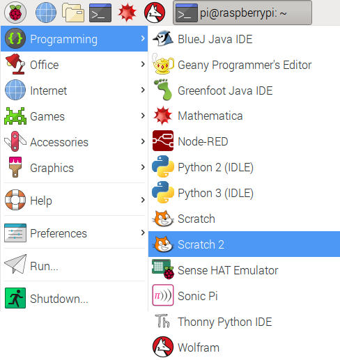

To open up Scratch 2 on the Raspberry Pi:

- Click on the menu icon in the top left-hand corner of the screen.

- Hover your mouse pointer over **Programming**.

- Select **Scratch 2** from the menu that appears.

	

- Your application should open in a few seconds.

	
