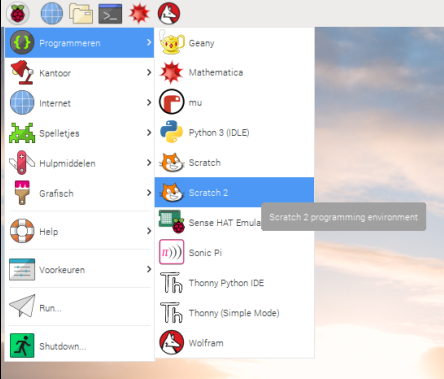
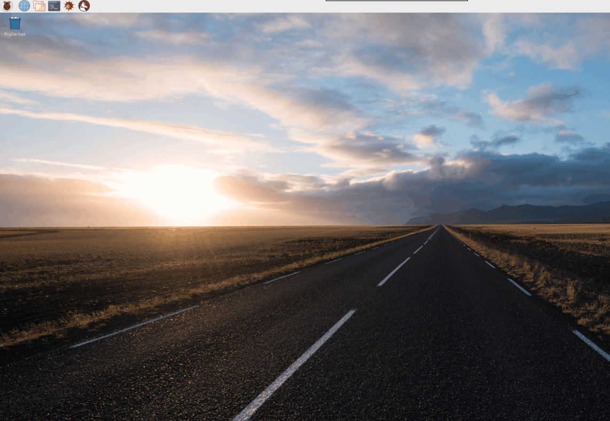

Om Scratch 2 op de Raspberry Pi te openen:

- Klik op het menupictogram in de linkerbovenhoek van het scherm.

- Beweeg je muisaanwijzer over **Programmeren**.

- Selecteer **Scratch 2** in het menu dat verschijnt.
    
    

- Je toepassing zou in een paar seconden moeten openen.
    
    